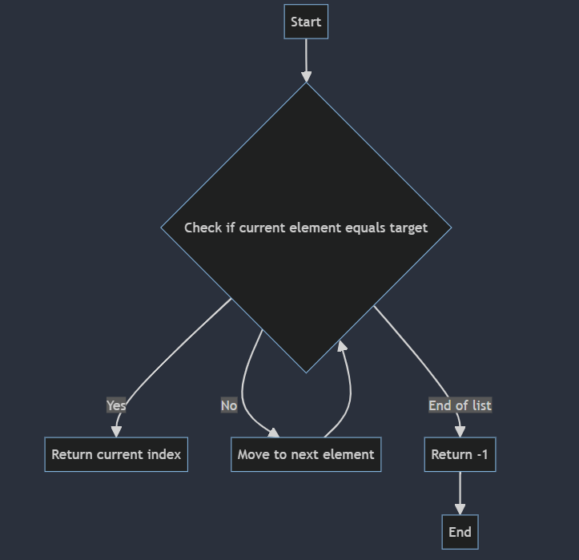
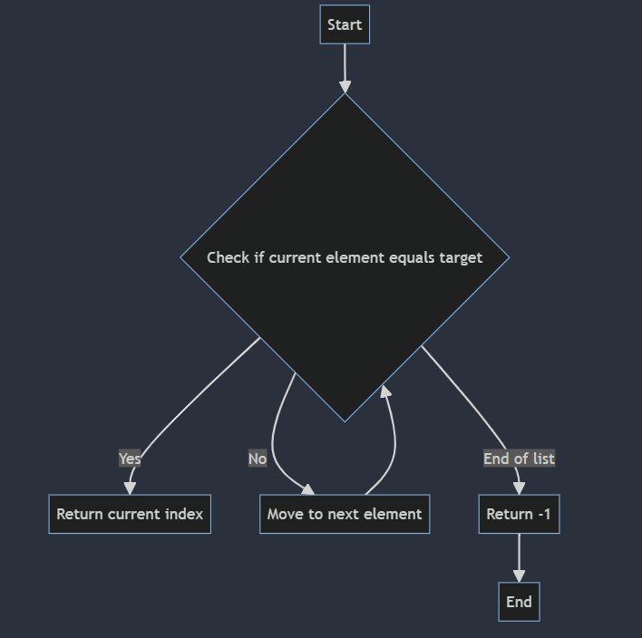
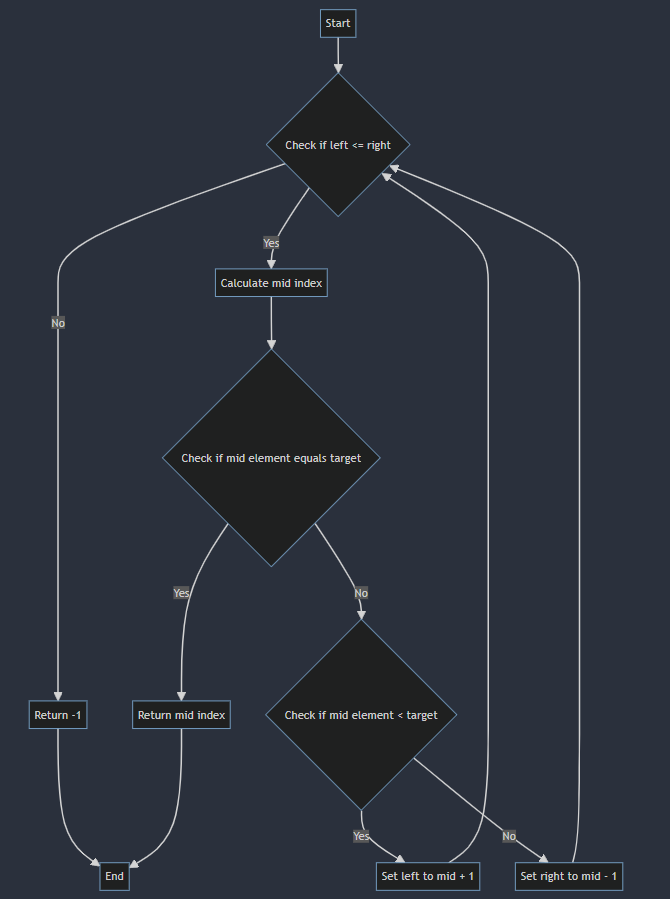
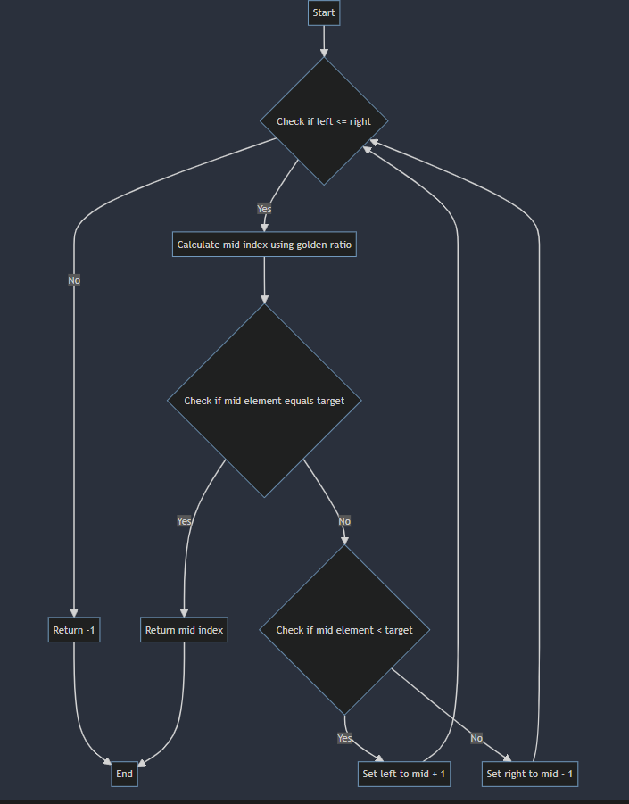
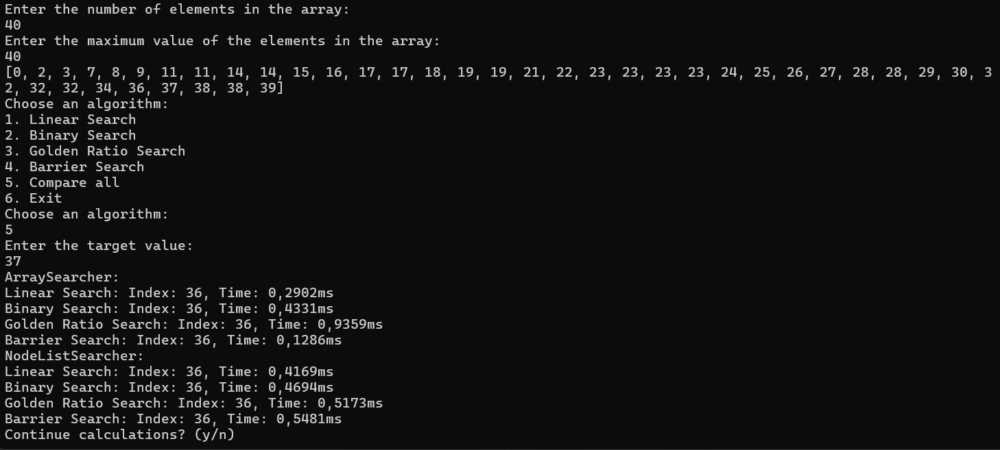

# Лабораторна робота № 1

## Умова задачі:
Написати програму мовою C# з можливістю вибору різних алгоритмів пошуку. Продемонструвати роботу ефективність (час виконання) програм на різних структурах даних (масив, лінійний зв’язаний список), з різними умовами, що забезпечують зменшення часу виконання. Навести аналіз отриманих результатів.

## Аналіз задачі:
Ця задача передбачає дослідження ефективності окремих алгоритмів пошуку для масиву та зв’язного списку. Після цього слід порівняти результати та визначити найкращий алгоритм пошуку та структуру даних.Для виконання цієї роботи ми використаємо класи Random і Stopwatch для генерації псевдовипадкових значень і визначення часу роботи програми відповідно.Для того, щоб гарантувати, що всі алгоритми знаходяться в однакових умовах масиву, зв’язний список буде попередньо відсортований.

## Алгоритми:
### Лінійний пошук


### Пошук з бар’єром


### Бінарний пошук


### Бінарний пошук на основі золотого перерізу


## Текст програми:
`Program.cs`
```csharp
using System.Diagnostics;

namespace ASDLab1;

public static class Program
{
    private const string InvalidInputMessage = "Invalid input. Please enter a valid integer.";
    private const string AlgorithmChoicePrompt = "Choose an algorithm:";
    private const string NumberOfElementsPrompt = "Enter the number of elements in the array: ";
    private const string MaxValuePrompt = "Enter the maximum value of the elements in the array: ";
    
    private static int GetInput(string prompt)
    {
        while (true)
        {
            Console.WriteLine(prompt);
            var input = Console.ReadLine();
            if (int.TryParse(input, out var value))
            {
                return value;
            }
            Console.WriteLine(InvalidInputMessage);
        }
    }

    private static TimeResult PerformAndTimeSearch(Func<int, int> searchMethod, int target)
    {
        var stopwatch = new Stopwatch();
        stopwatch.Start();
        var result = searchMethod(target);
        stopwatch.Stop();
        return new TimeResult(result, stopwatch.Elapsed.TotalMilliseconds);
    }
    private static void PerformSearchAndDisplayTime(Searcher searcher, int target, AlgorithmChoice methodName)
    {
        Console.WriteLine($"{searcher.GetType().Name}:");
        TimeResult result;
        switch (methodName)
        {
            case AlgorithmChoice.LinearSearch:
                result = PerformAndTimeSearch(searcher.LinearSearch, target);
                Console.WriteLine($"Index: {result.Index}, Time: {result.Time}ms");
                break;
            case AlgorithmChoice.BinarySearch:
                result = PerformAndTimeSearch(searcher.BinarySearch, target);
                Console.WriteLine($"Index: {result.Index}, Time: {result.Time}ms");
                break;
            case AlgorithmChoice.GoldenRatioSearch:
                result = PerformAndTimeSearch(searcher.GoldenRatioSearch, target);
                Console.WriteLine($"Index: {result.Index}, Time: {result.Time}ms");
                break;
            case AlgorithmChoice.BarrierSearch:
                result = PerformAndTimeSearch(searcher.BarrierSearch, target);
                Console.WriteLine($"Index: {result.Index}, Time: {result.Time}ms");
                break;

            case AlgorithmChoice.CompareAll:
                result = PerformAndTimeSearch(searcher.LinearSearch, target);
                Console.WriteLine($"Linear Search: Index: {result.Index}, Time: {result.Time}ms");
                result = PerformAndTimeSearch(searcher.BinarySearch, target);
                Console.WriteLine($"Binary Search: Index: {result.Index}, Time: {result.Time}ms");
                result = PerformAndTimeSearch(searcher.GoldenRatioSearch, target);
                Console.WriteLine($"Golden Ratio Search: Index: {result.Index}, Time: {result.Time}ms");
                result = PerformAndTimeSearch(searcher.BarrierSearch, target);
                Console.WriteLine($"Barrier Search: Index: {result.Index}, Time: {result.Time}ms");
                break;
            
        }
    }

    private static void DisplayMenu()
    {
        Console.WriteLine(AlgorithmChoicePrompt);
        Console.WriteLine("1. Linear Search");
        Console.WriteLine("2. Binary Search");
        Console.WriteLine("3. Golden Ratio Search");
        Console.WriteLine("4. Barrier Search");
        Console.WriteLine("5. Compare all");
        Console.WriteLine("6. Exit");
    }

    public static void Main()
    {
        var count = GetInput(NumberOfElementsPrompt);
        var maxValue = GetInput(MaxValuePrompt);

        var generator = new RandomNumberGenerator();
        
        var array = generator.GenerateNumbers(count, maxValue);
        var arraySearcher = new ArraySearcher(array);
        
        var myList = new NodeList();
        foreach (var num in array)
        {
            myList.Add(num);
        }
        var nodeListSearcher = new NodeListSearcher(myList);
        
        var continueCalculations = true;
        while (continueCalculations)
        {
            PrintArray(array);
            DisplayMenu();
            var choice = (AlgorithmChoice) GetInput(AlgorithmChoicePrompt);
            if (choice == AlgorithmChoice.Exit)
            {
                return;
            }
            var target = GetInput("Enter the target value: ");
            
            PerformSearchAndDisplayTime(arraySearcher, target, choice);
            PerformSearchAndDisplayTime(nodeListSearcher, target, choice);
            
            Console.WriteLine("Continue calculations? (y/n)");
            continueCalculations = Console.ReadLine()?.ToLower() == "y";
        }
    }
    private static void PrintArray(IEnumerable<int> array)
    {
        Console.WriteLine($"[{string.Join(", ", array)}]");
    }

}
```

`Searcher.cs`
```csharp
namespace ASDLab1;

public abstract class Searcher
{
    public abstract int LinearSearch(int target);
    public abstract int BinarySearch(int target);
    public abstract int GoldenRatioSearch(int target);
    public abstract int BarrierSearch(int target);
}
```

`ArraySearcher.cs`
```csharp
namespace ASDLab1;

public class ArraySearcher : Searcher
{
    private readonly int[] _array;

    public ArraySearcher(int[] array)
    {
        _array = array;
    }


    public override int LinearSearch(int target)
    {
        for (var i = 0; i < _array.Length; i++)
        {
            if (_array[i] == target)
            {
                return i;
            }
        }
        return -1;
    }

    public override int BinarySearch(int target)
    {
        Array.Sort(_array);
        var left = 0;
        var right = _array.Length - 1;
        while (left <= right)
        {
            var middle = (left + right) / 2;
            if (_array[middle] == target)
            {
                return middle;
            }

            if (_array[middle] < target)
            {
                left = middle + 1;
            }
            else
            {
                right = middle - 1;
            }
        }

        return -1;

    }

    public override int GoldenRatioSearch(int target)
    {
        Array.Sort(_array);
        int left = 0, right = _array.Length - 1;
        while (left <= right)
        {
            var mid = Convert.ToInt32((right - left) / 1.618 + left);
            if (_array[mid] == target) return mid;
            if (_array[mid] < target) left = mid + 1;
            else right = mid - 1;
        }
        return -1;
    }

    public override int BarrierSearch(int target)
    {
        var i = 0;
        for(; _array[i] != target; i++) { }
        return i;
    }
}
```

`NodeListSearcher.cs`
```csharp
namespace ASDLab1;
public class NodeListSearcher : Searcher
{
    private readonly NodeList _list;

    public NodeListSearcher(NodeList list)
    {
        _list = list;
    }

    public override int BinarySearch(int target)
    {
        int left = 0, right = _list.Length - 1;
        while (left <= right)
        {
            var mid = (left + right) / 2;
            var midNode = GetNodeAtIndex(_list, mid);

            if (midNode == null || midNode.Value == target) return mid;
            if (midNode.Value < target) left = mid + 1;
            else right = mid - 1;
        }
        return -1;
    }

    public override int LinearSearch(int target)
    {
        var current = _list.GetHead();
        for (var i = 0; i < _list.Length; i++)
        {
            if (current == null || current.Value == target)
                return i;
            current = current?.Next;
        }
        return -1;
    }

    public override int GoldenRatioSearch(int target)
    {
        int left = 0, right = _list.Length - 1;
        while (left <= right)
        {
            var mid = Convert.ToInt32((right - left) / 1.618 + left);
            var midNode = GetNodeAtIndex(_list, mid);

            if (midNode == null || midNode.Value == target) return mid;
            if (midNode.Value < target) left = mid + 1;
            else right = mid - 1;
        }
        return -1;
    }

    public override int BarrierSearch(int target)
    {
        var i = 0;
        for (; _list.ElementAt(i) != target; i++)
        {}
        return i;
    }

    private static Node? GetNodeAtIndex(NodeList list, int index)
    {
        return list.GetNodeAtIndex(index); 
    }
}
```

`NodeList.cs`
```csharp
public class NodeList
{
    Node? head;
    Node? tail;
    int length = 0;
    public int Length => length;

    
    public void Add(int data)
    {
        var node = new Node(data, null);

        head ??= node;

        if (tail != null) 
        {
            tail.Next = node;
        }
        tail = node;
        length++;
    }
    public Node? GetHead()
    {
        return head;
    }
    public void RemoveLast()
    {                                     
        Node? current = head;
        while(current?.Next?.Next != null)
        {                   
            current = current.Next;
        }
        tail = current;
        if (tail != null) tail.Next = null;
        length--;

    }
    public int ElementAt(int index)
    {
        Node? current = head;
        for(int i = 0; i < index;i++)
        {
            current = current?.Next;
        }
        return current?.Value ?? default;
    }
    
    public void Print()
    {
        var current = head;
        while(current != null)
        {
            Console.Write(current.Value + "\t");
            current = current.Next;
        }
        Console.WriteLine();
    }


    public void Sort()
    {
        var current = head;
        for (var i = 0; i < length; i++)
        {
            Node? previous = null;
            for (var j = 0; j < length - 1; j++)
            {
                previous = current;
                current = current?.Next;
                if (previous != null && current != null && previous.Value > current.Value)
                {
                    (current.Value, previous.Value) = (previous.Value, current.Value);
                }
            }
            current = head;
            previous = null;
        }
    }
    
    public Node? GetNodeAtIndex(int index)
    {
        if (index < 0 || index >= length)
        {
            return null;
        }

        var current = head;
        for (var i = 0; i < index && current != null; i++)
        {
            current = current.Next;
        }
        return current;
    }
}

public class Node
{
    public Node(int value, Node? next) 
    { 
        this.Value = value;
        this.Next = next;
        next = null;
    }

    public int Value { get; set; }

    public Node? Next { get; set; }
}
```
`RandomNumberGenerator.cs`
```csharp
namespace ASDLab1;

public class RandomNumberGenerator
{
    private readonly Random _random = new();

    public int[] GenerateNumbers(int count, int maxValue)
    {
        if (count < 0)
        {
            throw new ArgumentException("Count cannot be negative");
        }
        
        var numbers = new int[count];
        for (var i = 0; i < count; i++)
        {
            numbers[i] = _random.Next(maxValue);
        }
        return numbers;
    }
}
```

`TimeResult.cs`
```csharp
namespace ASDLab1;

public record TimeResult(int Index, double Time);
```

`AlgorithmChoice.cs`
```csharp
namespace ASDLab1;

public enum AlgorithmChoice
{
    LinearSearch = 1,
    BinarySearch,
    GoldenRatioSearch,
    BarrierSearch,
    CompareAll,
    Exit
}
```
Вихідний код програми можна знайти [тут](https://github.com/sinarhen-knu/AlgorithmsDataStructures/tree/main/ASDLab1)

## Аналіз результатів:

Порівнявши результати бачимо, що пошук в масиві і пошук у зв’язному списку працює майже однаково по часу. Також якщо порівняти алгоритми пошуку бачимо, що найкраще працює ба’єрний пошук, а найгірше – бінарний пошук на основі золотого перерізу. Бінарний пошук на основі золотого перерізу працює повільніше за звичайний через зміщення порівнюваного елемента.

## Висновок:
Виконуючи цю лабораторну роботу, ми дослідили ефективність різних алгоритмів пошуку на різних структурах даних. Ми виявили, що бар'єрний пошук є найефективнішим алгоритмом для нашого набору даних, а бінарний пошук на основі золотого перерізу є найменш ефективним. Ці результати можуть змінюватися в залежності від розміру та характеру даних, тому важливо вибирати правильний алгоритм для конкретного набору даних.
