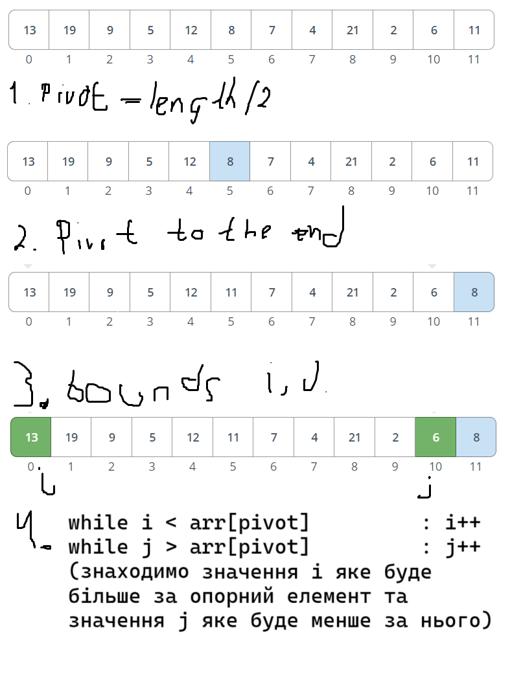

# Лабораторна робота №2

## Умова задачі:

1. Проілюструйте роботу процедури PARTITION з масивом А = (13,19,9,5,12,8,7,4,21,2,6,11).
2. Яке значення q повертає процедура PARTITION, якщо всі елементи масиву А[р...r] однакові? Модифікуйте цю процедуру так, щоб у випадку, коли всі елементи масиву А[р...r] мають те саме значення, q визначається наступним чином: q= (p+r)/2
3. Напишіть процедуру QUICKSORT для сортування у незростаючому порядку.
4. Напишіть процедуру RANDOMIZED-QUICKSORT для сортування у незростаючому порядку.
5. Проілюструйте обробку масиву А = (6,0,2,0,1,3,4,6,1,3,2) процедурою COUNTING-SORT.
6. Опишіть алгоритм попередньої обробки n елементів, що належать інтервалу від 0 до k, після якого можна отримати відповідь на запит про те, скільки з n вхідних елементів належать відрізку [а…b], за час 0(1). Алгоритм повинен виконуватись за час Θ(n+k)
7. Проілюструйте роботу алгоритму RADIX-SORT з наступним списком англійських слів: COW, DOG, SEA, RUG, ROW, MOB, BOX, TAB, BAR, EAR, TAR, DIG, BIG, TEA, NOW, FOX.
8. Проілюструйте роботу алгоритму BUCKET-SORT з масивом А = (.79, .13, .16, .64, .39, .20, .89, .53, .71, .42).
9. Ви працюєте консультантом у нафтовій компанії, яка планує провести магістральний трубопровід від східного до західного краю нафтового родовища зі свердловинами. Від кожної свердловини до магістрального трубопроводу найкоротшим шляхом у напрямку на північ або на південь проведені рукави. Яким чином Ви може вибрати оптимальне розташування трубопроводу (тобто таке, при якому загальна довжина всіх рукавів була б мінімальною) за заданими координатами свердловин (х, у)? Покажіть, що це можна зробити протягом часу, що лінійно залежить від кількості свердловин.


## Аналіз завдання

2. **Змінна "елементиAreEqual"**:
 Вводиться змінна "елементиAreEqual", яка спочатку істинна.
Якщо алгоритм зробив хоча б одну заміну, змінна стає 0.
Перевірка значення змінної використовується для виходу з циклу.
4. **Швидке сортування з випадковим опорним елементом**: Опорний елемент може бути переміщений під час роботи алгоритму.
Після збільшення j перевіряється, чи воно не дорівнює індексу опорного елемента.
Якщо так, j ще раз збільшується.
Опорний елемент в першій частині масиву не впливає на інваріант.
6. **Сортування за допомогою допоміжного масиву**: Алгоритм схожий на сортування підрахунком, але не потребує двох проходів.
Допоміжний масив С використовується для зберігання суми елементів у проміжку (a..b).
Алгоритм CountingSort можна модифікувати для роботи з від'ємними числами.
Цей метод економить пам'ять, коли елементи масиву мають високі значення, але розташовані на короткому інтервалі.
9. **Пошук медіани в масиві координат**: Медіана знаходиться в координатах між нафтовими вежами.
Якщо n непарне, медіана знаходиться в одній з труб.
Якщо n парне, медіана знаходиться в діапазоні координат двох труб.
Для пошуку медіани використовується масив зі зв'язаними списками.
Сортується лише один список, який містить медіану.
Алгоритм розподілу з шести завдань може бути використаний для роботи з від'ємними числами.
Перед пошуком медіани знайдений список потрібно відсортувати за допомогою алгоритму сортування вставками.

## Завдання 1



## Завдання 2 
Модифікована версія процедури PARTITION, яка встановлює q = (p+r)/2, коли всі елементи масиву однакові, може виглядати так:
```csharp
public int Partition(int[] A, int p, int r)
{
    int x = A[r];
    bool allElementsAreEqual = true;
    for (int i = p; i < r; i++)
    {
        if (A[i] != x)
        {
            allElementsAreEqual = false;
            break;
        }
    }

    if (allElementsAreEqual)
    {
        return (p + r) / 2;
    }

    int i = p - 1;
    for (int j = p; j < r; j++)
    {
        if (A[j] <= x)
        {
            i++;
            (A[i], A[j]) = (A[j], A[i]);
        }
    }
    (A[i + 1], A[r]) = (A[r], A[i + 1]);
    return i + 1;
}
```

## Завдання 3
```csharp

private static void QuickSort(int[] array, int left, int right)
    {
        int i = left;
        int j = right;
        var pivot = array[left];

        while (i <= j)
        {
            while (array[i] > pivot) // у зростаючому ми б порівнювали: array[i] < pivot
            {
                i++;
            }

            while (array[j] < pivot) // у зростаючому ми б порівнювали: array[j] > pivot
            {
                j--;
            }

            if (i <= j)
            {
                Swap(array, i, j);
                i++;
                j--;
            }


        }
        if (left < j)
            QuickSort(array, left, j);
        if (right > i)
            QuickSort(array, i, right);
        
    }

```

## Завдання 4 
замість вибору pivot як першого, останнього, або середнього елементу
ми обираємо його випадково 
```csharp
    var rng = new Random();
    int pivot = rng.Next(start, end);
```

## Завдання 5
```csharp
    private static void CountSort(int[] array)
    {
        var max = array.Max();
        var countArr = new int[max + 1];
        for (int i = 0; i < array.Length; i++)
        {
            countArr[array[i]] += 1;
        }

        Console.Write("count array");
        Console.WriteLine($"Count arr: [{string.Join(", ", countArr)}]");

        for (int i = 1; i < countArr.Length; i++)
        {
            countArr[i] = countArr[i] + countArr[i - 1];
        }

        Console.WriteLine($"Count arr after summing: [{string.Join(", ", countArr)}]");
        var resultArr = new int[array.Length];
        for (int i = array.Length - 1; i >= 0; i--)
        {
            resultArr[countArr[array[i]] - 1] = array[i];
            countArr[array[i]]--;
        }
        
        Console.WriteLine($"Result array: [{string.Join(", ", resultArr)}]");
        
    }
```


## Завдання 6
Створити масив count з розміром k+1, де k - це максимальне значення вхідного масиву. Всі значення в масиві count ініціалізуються як 0.
Пройтись по вхідному масиву і для кожного елементу i збільшіть count[i] на 1. Це дозволить підрахувати кількість кожного елемента в масиві.
Пройтись по масиву count і замінити кожне значення count[i] на суму count[i] і count[i-1]. Це перетворить count на масив префіксних сум, де count[i] відповідає кількості елементів в масиві, що менші або рівні i.
Тепер, щоб отримати відповідь на запит про те, скільки з n вхідних елементів належать відрізку [a...b], просто відняти count[a-1] від count[b].

## Завдання 7
```csharp
    private static void Main()
    {
        var words = new[] { "COW", "DOG", "SEA", "RUG", "ROW", "MOB", "BOX", "TAB", "BAR", "EAR", "TAR", "DIG", "BIG", "TEA", "NOW", "FOX" };
        Console.WriteLine($"Words before radix sort: [{string.Join(", ", words)}]\n");
        RadixSort(words);
        Console.WriteLine($"Words after radix sort: [{string.Join(", ", words)}]\n");
    }
    private static void RadixSort(string[] words)
    {
        var maxLength = words.Max(word => word.Length);

        for (var position = maxLength - 1; position >= 0; position--)
        {
            CountingSortByPosition(words, position);
        }
    }

    private static void CountingSortByPosition(string[] words, int position)
    {
        const int alphabetSize = 26;
        var count = new int[alphabetSize];
        var output = new string[words.Length];

        foreach (var word in words)
        {
            var index = position < word.Length ? word[position] - 'A' : 0;
            count[index]++;
        }

        for (var i = 1; i < alphabetSize; i++)
        {
            count[i] += count[i - 1];
        }

        for (var i = words.Length - 1; i >= 0; i--)
        {
            var index = position < words[i].Length ? words[i][position] - 'A' : 0;
            output[count[index] - 1] = words[i];
            count[index]--;
        }

        for (var i = 0; i < words.Length; i++)
        {
            words[i] = output[i];
        }
    }
```

```bash
Words before radix sort: [COW, DOG, SEA, RUG, ROW, MOB, BOX, TAB, BAR, EAR, TAR, DIG, BIG, TEA, NOW, FOX]

Words after radix sort: [BAR, BIG, BOX, COW, DIG, DOG, EAR, FOX, MOB, NOW, ROW, RUG, SEA, TAB, TAR, TEA]
```

## Завдання 8 
```csharp
    public static void Main(string[] args)
    {
        double[] array = [.79, .13, .16, .64, .39, .20, .89, .53, .71, .42];
        Console.WriteLine($"Array: [{string.Join(", ", array)}]");
        BucketSort(array);
        Console.WriteLine($"Array sorted: [{string.Join(", ", array)}]");
    }
    private static void BucketSort(double[] array)
    {
        var buckets = new List<List<double>>();
        for (int i = 0; i < 10; i++)
        {
            buckets.Add(new List<double>());
        }
        for (int i = 0; i < array.Length; i++)
        {
            buckets[(int)array[i] * 10].Add(array[i]);
        }

        for (int i = 0; i < buckets.Count; i++)
        {
            if (buckets[i].Count > 1)
            {
                InsertionSort(buckets[i]);
            }

            for (int j = 0; j < buckets[i].Count; j++)
            {
                array[i + j] = buckets[i][j];
            }
        }
    }
```
```bash
Array: [0,79, 0,13, 0,16, 0,64, 0,39, 0,2, 0,89, 0,53, 0,71, 0,42]
Array sorted: [0,13, 0,16, 0,2, 0,39, 0,42, 0,53, 0,64, 0,71, 0,79, 0,89]
```


## Висновок 
В ході виконання лабораторної роботи було вивчено алгоритми сортування, а саме: QUICKSORT, RANDOMIZED-QUICKSORT, COUNTING-SORT, RADIX-SORT, BUCKET-SORT. Також було вивчено алгоритм попередньої обробки n елементів, що належать інтервалу від 0 до k, після якого можна отримати відповідь на запит про те, скільки з n вхідних елементів належать відрізку [а…b], за час 0(1). Алгоритм повинен виконуватись за час Θ(n+k). Також було вивчено алгоритм попередньої обробки n елементів, що належать інтервалу від 0 до k, після якого можна отримати відповідь на запит про те, скільки з n вхідних елементів належать відрізку [а…b], за час 0(1). Алгоритм повинен виконуватись за час Θ(n+k). Також було вивчено алгоритм попередньої обробки n елементів, що належать інтервалу від 0 до k, після якого можна отримати відповідь на запит про те, скільки з n вхідних елементів належать відрізку [а…b], за час 0(1). Алгоритм повин
