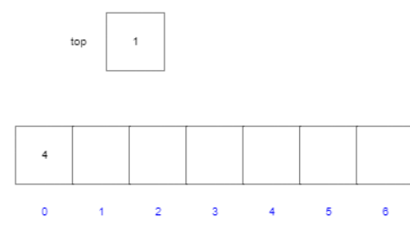
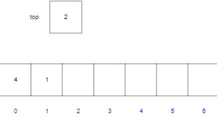
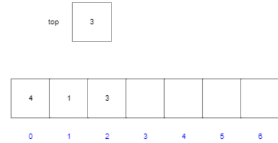
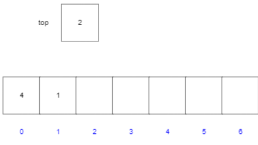
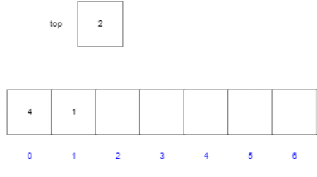
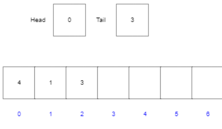
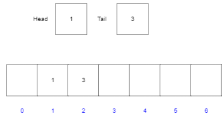
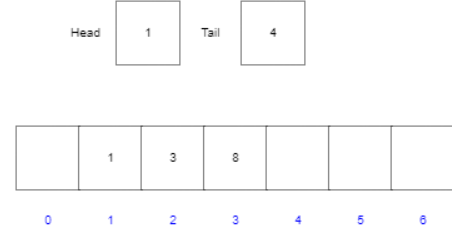
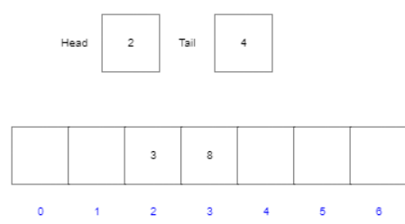

# Лабораторна робота №2

## Умова задачі:

1. Використовуючи рисунок з лекції (стек) як зразок, проілюструйте результат впливу на спочатку порожній стек S, що зберігається в масиві S[1…6], послідовності операцій PUSH(S,4), PUSH(S,1), PUSH(S,3), POP(S), PUSH(S,8) і POP(S).
2. Поясніть, як за допомогою одного масиву А[1…n] можна реалізувати два стеки таким чином, щоб жоден з них не переповнювався, поки сумарна кількість елементів в обох стеках не досягне n. Операції PUSH і POP мають виконуватися за час О(1).
3. Використовуючи рисунок  з лекції (черга) як зразок, проілюструйте результат кожної з операцій у послідовності ENQUEUE(Q,4), ENQUEUE(Q, 1), ENQUEUE(Q,3), DEQUEUE(Q), ENQUEUE(Q,8) І DEQUEUE(Q ) над початково порожньою чергою Q, що зберігається у масиві Q[1…6].
4. Перепишіть процедури ENQUEUE І DEQUEUE так, щоб вони коректно виявляли спустошення і переповнення черги.
5. При роботі зі стеком елементи можна додавати до нього та витягувати з нього лише з одного кінця. Черга дозволяє додавати елементи з одного кінця, а витягувати з іншого. Черга з двостороннім доступом, або дек, надає можливість проводити вставку та видалення з обох кінців. Напишіть чотири методи, що виконуються за час О(1) і дозволяють вставляти та видаляти елементи з обох кінців дека, реалізованого за допомогою масиву.
6. Покажіть, як реалізувати чергу за допомогою двох стеків. Проаналізуйте час роботи операцій, які виконуються із її елементами.
7. Покажіть, як реалізувати стек за допомогою двох черг. Проаналізуйте час роботи операцій, що виконуються з його елементами.
8. Реалізуйте стек за допомогою лінійного зв'язаного списку L. Операції PUSH і POP мають виконуватися за час O(1).
9. Реалізуйте чергу за допомогою лінійного зв'язаного списку L. Операції ENQUEUE і DEQUEUE мають виконуватися за час О(1


## Аналіз завдання


## Завдання 1
1. `PUSH(S,4)`:
   - Стек: 4
   - 
   
2. `PUSH(S,1)`:
   - Стек: 4, 1
   - 

3. `PUSH(S,3)`:
   - Стек: 4, 1, 3
   - 

4. `POP(S)`:
   - Стек: 4, 1
   - 

5. `PUSH(S,8)`: 
   - Стек: 4, 1, 8
   - 
6. `POP(S)`:
   - Стек: 4, 1
   - 


## Завдання 2
Для цього потрібно контролювати кількість елементів в масиві, а також вказувати на початок і кінець кожного стеку. Також потрібно вказувати на межі кожного стеку. Якщо ми використовуємо масив розміром n, то можемо використовувати індекси від 1 до n. Якщо ми використовуємо один масив для двох стеків, то можемо використовувати індекси від 1 до n. Початок першого стеку буде вказувати на 1, а кінець на n/2. Початок другого стеку буде вказувати на n/2+1.

## Завдання 3

1. `ENQUEUE(Q, 4); ENQUEUE(Q, 1); ENQUEUE(Q, 3)`;

2. `DEQUEUE(Q)`;

3. `ENQUEUE(Q, 8)`;

4. `DEQUEUE(Q)`;



## Завдання 4
```c++
void ENQUEUE(int x) {
    if (tail == n) {
        tail = 1;
    } else {
        tail = tail + 1;
    }
    if (tail == head) {
        cout << "Queue is full" << endl;
    } else {
        Q[tail] = x;
    }
}
```

```c++

void DEQUEUE() {
    if (head == tail) {
        cout << "Queue is empty" << endl;
    } else {
        if (head == n) {
            head = 1;
        } else {
            head = head + 1;
        }
    }
}
```

## Завдання 5
```c++
void INSERT_FRONT(int x) {
   if (head == 0) {
       printf("Deque is full\n");
   } 
   else {
        head = head - 1;
        Q[head] = x;
    }
}

void INSERT_BACK(int x) {
    if (tail == n-1) {
        printf("Deque is full\n");
    } else {
        tail = tail + 1;
        Q[tail] = x;
    }
}

void DELETE_FRONT() {
   if (head == tail) {
        printf("Deque is empty\n");
   } else {
        head = head + 1;
   }
}

void DELETE_BACK() {
    if (head == tail) {
        printf("Deque is empty\n"); 
    } else {
        tail = tail - 1;
    }
}

```

## Завдання 6

`queue.h`
```c++
#ifndef QUEUE_H
#define QUEUE_H

#include <stdio.h>
#include <stdlib.h>


struct Queue {
    int head, tail, size;
    unsigned capacity;
    int* array;
};

typedef struct Queue Queue;

Queue* createQueue(unsigned capacity) {
    struct Queue* queue = (struct Queue*)malloc(sizeof(struct Queue));
    queue->capacity = capacity;
    queue->head = 0;
    queue->size = 0;
    queue->tail = capacity - 1;
    queue->array = (int*)malloc(queue->capacity * sizeof(int));

    return queue;
}


void enqueue(Queue* queue, int value) {
    if (queue->size == queue-> capacity) return;

    queue->tail = (queue -> tail + 1)%queue->capacity;
    queue -> size += 1;
    queue->array[queue->tail] = value;
}

int dequeue(Queue* queue){
    if (queue-> size == 0){
        return -1;
    }
    int value = queue->array[queue -> head];
    queue -> head = (queue -> head + 1) % queue -> capacity;
    queue -> size = queue -> size - 1;
    return value ;
}

void printQueue(Queue* queue){
    for(int i = 0; i < queue -> size; i++){
        printf("%d-th queued element is a %d\n", i, queue->array[(queue->head + i)%queue->capacity]);
    }
}

void freeQueue(Queue* queue) {
    free(queue->array);
    free(queue);
}

#endif
```

`doublestackq.h`
```c++
#ifndef DOUBLESTACKQ_H
#define DOUBLESTACKQ_H

#include "stack.h"

struct DoubleStackQ {
    Stack* s1;
    Stack* s2;
};

typedef struct DoubleStackQ DoubleStackQ;

DoubleStackQ* createDoubleStackQ(int capacity){
    DoubleStackQ* q = (DoubleStackQ*)malloc(sizeof(DoubleStackQ));
    q->s1 = createStack(capacity);
    q->s2 = createStack(capacity);
    return q;
}

void doubleStackQEnqueue(DoubleStackQ* q, int el){
    stackPush(q->s1, el);
}

int doubleStackQDequeue(DoubleStackQ* q){

    if (q->s2->top == 0){
        while (q->s1->top > 0){
            int el = stackPop(q->s1);
            stackPush(q->s2, el);
        }
    }
    return stackPop(q->s2);
}


void freeDoubleStackQ(DoubleStackQ* q){
    freeStack(q->s1);
    freeStack(q->s2);
    free(q);
}

#endif DOUBLESTACKQ_H
```
принцип реалізації стека за допомогою двох 
черг полягає у додаванні спочатку елементів в один масив, а при POP усі елементи окрім останнього з першої черги завдяки DEQUEUE переносяться в другу чергу,
елемент який залишився в першій черзі видаляється і повертається. Після цього поінтер поінтери черг взаємозмінюються
і перша черга стає другою, а друга першою.
Ось приклад роботи:
```pseudo 
queue1 add 1
queue1 add 2
queue1 add 3
queue1 add 4

print queue1
1 2 3 4

dequeue queue1 until 1 element left

print queue1
4

pop queue1
4

print queue1
NULL

print queue2
1 2 3

pointer queue1 = pointer queue2
pointer queue2 = pointer queue1

print queue1
1 2 3
```


## Завдання 7
`stack.h`
```c++
#ifndef STACK_H
#define STACK_H

#include <stdio.h>
#include <stdlib.h>

struct Stack {
    int top;
    unsigned capacity;
    int* array;
};


typedef struct Stack Stack;

Stack* createStack(int size)
{
    Stack* stack = (Stack*)malloc(sizeof(Stack));
    stack->capacity = size;
    stack->top = 0;
    stack->array = (int*)malloc(sizeof(int) * size);

    return stack;
}

void freeStack(Stack* stack)
{
    free(stack->array);
    free(stack);
}

void stackPush(Stack* stack, int x){
    if (stack->top == stack->capacity) return;
    stack->array[stack->top] = x;
    stack->top = (stack->top + 1);
}

int stackPop(Stack* stack){
    if (stack->top == 0) return -1;
    stack->top = stack->top - 1;
    int temp = stack->array[stack->top];
    return temp;
}

#endif
```


```c++
#ifndef DOUBLESTACKQ_H
#define DOUBLESTACKQ_H

#include "stack.h"

struct DoubleStackQ {
    Stack* s1;
    Stack* s2;
};

typedef struct DoubleStackQ DoubleStackQ;

DoubleStackQ* createDoubleStackQ(int capacity){
    DoubleStackQ* q = (DoubleStackQ*)malloc(sizeof(DoubleStackQ));
    q->s1 = createStack(capacity);
    q->s2 = createStack(capacity);
    return q;
}

void doubleStackQEnqueue(DoubleStackQ* q, int el){
    stackPush(q->s1, el);
}

int doubleStackQDequeue(DoubleStackQ* q){

    if (q->s2->top == 0){
        while (q->s1->top > 0){
            int el = stackPop(q->s1);
            stackPush(q->s2, el);
        }
    }
    return stackPop(q->s2);
}


void freeDoubleStackQ(DoubleStackQ* q){
    freeStack(q->s1);
    freeStack(q->s2);
    free(q);
}

#endif DOUBLESTACKQ_H
```
Принцип реалізації черги за допомогою двох стеків полягає в тому що при додаванні всі елементи додаються в перший стек 
наприклад 1, 2, 3, 4

при POP усі елементи окрім першого переносяться в другий масив, а перший елемент видаляється і повертається. 
Після цього другий масив вже не пустий і в такому випадку ми просто виконуємо POP з другого масиву.

Ось приклад роботи:
```pseudo
stack1 push 1
stack1 push 2
stack1 push 3
stack1 push 4

print stack1
1 2 3 4

pop stack1 until 1 element left

print stack1
1

pop stack1
1


print stack2
4 3 2

pop stack2
2

print stack2
4 3
```

## Завдання 8
```c++

#include <stdio.h>
#include <stdlib.h>

struct Node {
    int data;
    struct Node* next;
};

typedef struct Node Node;

struct LnkStack {
    Node* top;
};

typedef struct LnkStack LnkStack;

LnkStack* createLnkStack() {
    LnkStack* stack = (LnkStack*)malloc(sizeof(LnkStack));
    stack->top = NULL;
    return stack;
}

void push(LnkStack* stack, int value) {
    Node* node = (Node*)malloc(sizeof(Node));
    node->data = value;
    node->next = stack->top;
    stack->top = node;
}

int pop(LnkStack* stack) {
    if (stack->top == NULL) return -1;
    Node* temp = stack->top;
    stack->top = stack->top->next;
    int value = temp->data;
    free(temp);
    return value;
}

void printLnkStack(LnkStack* stack) {
    Node* temp = stack->top;
    while (temp != NULL) {
        printf("%d\n", temp->data);
        temp = temp->next;
    }
}

void freeLnkStack(LnkStack* stack) {
    Node* temp = stack->top;
    while (temp != NULL) {
        Node* next = temp->next;
        free(temp);
        temp = next;
    }
    free(stack);
}
```

## Завдання 9
```c++

#include <stdio.h>
#include <stdlib.h>

struct Node {
    int data;
    struct Node* next;
};

typedef struct Node Node;

struct LnkQueue {
    Node* head;
    Node* tail;
};

typedef struct LnkQueue LnkQueue;

LnkQueue* createLnkQueue() {
    LnkQueue* queue = (LnkQueue*)malloc(sizeof(LnkQueue));
    queue->head = NULL;
    queue->tail = NULL;
    return queue;
}

void enqueue(LnkQueue* queue, int value) {
    Node* node = (Node*)malloc(sizeof(Node));
    node->data = value;
    node->next = NULL;
    if (queue->head == NULL) {
        queue->head = node;
        queue->tail = node;
    } else {
        queue->tail->next = node;
        queue->tail = node;
    }
}

int dequeue(LnkQueue* queue) {
    if (queue->head == NULL) return -1;
    Node* temp = queue->head;
    queue->head = queue->head->next;
    int value = temp->data;
    free(temp);
    return value;
}

void printLnkQueue(LnkQueue* queue) {
    Node* temp = queue->head;
    while (temp != NULL) {
        printf("%d\n", temp->data);
        temp = temp->next;
    }
}

void freeLnkQueue(LnkQueue* queue) {
    Node* temp = queue->head;
    while (temp != NULL) {
        Node* next = temp->next;
        free(temp);
        temp = next;
    }
    free(queue);
}
```

## Висновок
В ході виконання лабораторної роботи було вивчено алгоритми сортування, а саме: QUICKSORT, RANDOMIZED-QUICKSORT, COUNTING-SORT, RADIX-SORT, BUCKET-SORT. Також було вивчено алгоритм попередньої обробки n елементів, що належать інтервалу від 0 до k, після якого можна отримати відповідь на запит про те, скільки з n вхідних елементів належать відрізку [а…b], за час 0(1). Алгоритм повинен виконуватись за час Θ(n+k). Також було вивчено алгоритм попередньої обробки n елементів, що належать інтервалу від 0 до k, після якого можна отримати відповідь на запит про те, скільки з n вхідних елементів належать відрізку [а…b], за час 0(1). Алгоритм повинен виконуватись за час Θ(n+k). Також було вивчено алгоритм попередньої обробки n елементів, що належать інтервалу від 0 до k, після якого можна отримати відповідь на запит про те, скільки з n вхідних елементів належать відрізку [а…b], за час 0(1). Алгоритм повин
